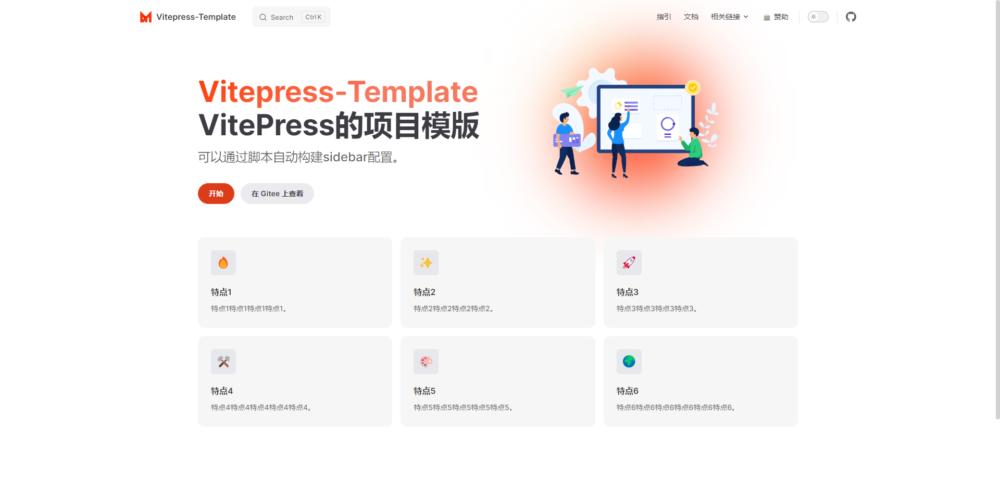

# 说明
一个VitePress的项目模版，可以通过脚本自动构建sidebar配置，只需要维护一份映射文件即可，非常方便。

## 目录结构

```txt
│  index.md                 # 首页配置
│
├─.vitepress                # vitepress文件夹
│  │  config.mts            # vitepress配置导航栏和侧边栏等配置
│  ├─components             # 存放组件
│  └─theme                  # 主题配置
│      │  index.ts          # 配置主题
│      │ 
│      └─styles             # 存放样式
│              index.scss   # 自定义主题样式
│
├─guide                     # 存放页面文件夹
│  │  GenerateMapping.ps1   # 生成映射文件脚本
│  │  mapping.json          # 映射文件
│  │  set_sidebar.mts       # 设置侧边栏脚本
│  │
│  ├─configs                # 配置页面文件夹
│  │      config.md         # 配置页面markdown文件
├─public                    # 存放静态资源
│
└─sponsor                   # 捐赠页面文件夹
```

## 生成映射文件
在guide文件夹下，使用`powershell`运行`GenerateMapping.ps1`脚本，会自动扫描guide文件夹下的所有文件夹和文件，生成`mapping.json`文件。
在`mapping.json`文件中，可以配置每个文件夹下的文件，以及文件夹的标题信息。比如：

```json
{
	"configs":  "配置",
	"docs":  "文档",
	"introduce":  "指引",
	"config.md":  "配置内容",
	"doc.md":  "文档内容",
	"quickstart":  "快速开始",
	"demo.md":  "示例",
	"introduce.md":  "介绍",
	"get-start.md":  "入门"
}
```
在config.mts,我们不需要手动配置侧边栏，只需调用`set_sidebar`方法即可。
```typescript
import { set_sidebar } from './guide/set_sidebar.mts'

//侧边栏配置
sidebar: {
	"/guide/introduce/": set_sidebar('/guide/introduce'),
	"/guide/docs/": set_sidebar('/guide/docs'),
}
```

## 配置主题色
在`theme/styles/index.scss`文件中，可以配置主题色，比如：
```scss
:root {
	--vp-c-brand: #DB3C19;
	--vp-c-brand-light:#EF4619;
	--vp-c-brand-lighter:#FA6037;
	--vp-c-brand-lightest: #F6785D;
	--vp-c-brand-dark: #F14619;
	--vp-c-brand-darker: #FF3803;
	--vp-c-brand-dimm: #7B1803;
}
```
具体可以参考vitepress官方文档：[https://vitepress.dev/zh/guide/extending-default-theme](https://vitepress.dev/zh/guide/extending-default-theme)

## 本地运行

```bash
# 安装依赖
npm install

# 本地浏览
npm run docs:dev 
```


## 发布部署

```bash
npm run docs:build 
```
